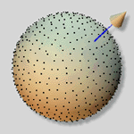
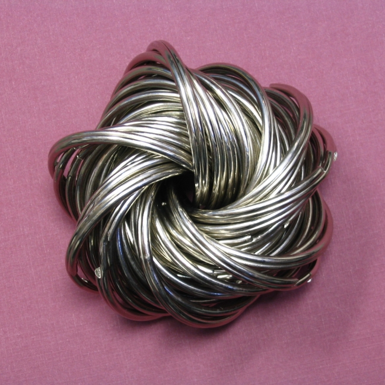

---
author:
  - Wai-Shing Luk
bibliography:
  - n-sphere.bib
title: Low Discrepency Sampling Method on N-dimensional Sphere
...

## Abstract

We discuss the generation of low discrepancy sequences over n-sphere. The introduction provides an overview of the importance of low discrepancy sequences in various applications, such as numerical integration, optimization, and simulation. The paper then discusses the desirable properties of samples over n-sphere, including uniformity, determinism, and incrementality.

The proposed method for generating low discrepancy sequences over n-sphere is then presented, which is based on the Van der Corput sequence. The paper provides a detailed explanation of the algorithm and its implementation. The paper also discusses the numerical experiments conducted to evaluate the performance of the proposed method, including the comparison with randomly generated sequences and other proposed methods.

# Motivation

Low discrepancy sequences play a crucial role in various fields of mathematics, computer science, and engineering. These sequences provide a more uniform distribution of points compared to random sampling, making them invaluable tools for applications such as numerical integration, optimization, and simulation. While low discrepancy sampling methods have been well-studied for lower dimensions, particularly for spheres in 3D space, there is a growing need for efficient sampling techniques in higher dimensions.

Low discrepancy sequences offer several advantages over traditional random sampling methods:

- Uniform Distribution: They provide a more even distribution of points, reducing computational errors in various applications.
- Efficiency: These sequences can achieve high accuracy with fewer samples, especially in high-dimensional spaces, making them computationally efficient.
- Wide Application: From robot motion planning to wireless communication coding, low discrepancy sequences find use in solving complex problems across multiple industries.

As we move to higher dimensions, several challenges emerge:

- Curse of Dimensionality: Achieving uniform distribution becomes increasingly difficult as the number of dimensions increases.
- Theoretical Gaps: While sampling methods for three-dimensional spherical surfaces are well-established, the theory for higher dimensions is still developing.
- Technical Challenges: There is a lack of comprehensive sampling strategies that can be universally applied across all dimensions while preserving uniformity, determinism, and incrementality.

More importantly, the uniformity measures are optimized with every new point, and this is because in some applications, it is unknown how many points are needed to solve the problem in advance.

The paper proposes a method for generating low discrepancy sequences on n-dimensional spheres based on the Van der Corput sequence. This approach aims to address the challenges of high-dimensional sampling while maintaining the desirable properties of low discrepancy sequences.

## Potential Applications

The proposed method for n-dimensional spherical sampling has potential applications in various fields:

- Robot Motion Planning [@yershova2010generating]: In high-dimensional spaces such as $S^3$ and $SO(3)$, Halton sequences provide uniformly distributed point sets, which are suitable for robot path planning and attitude control to optimize the computational efficiency and accuracy of motion trajectories.

- Wireless Communication Coding [@utkovski2006construction]: Spherical coding in MIMO systems utilizes the dots generated by Halton sequences as codewords to enhance the stability and anti-interference ability of signal transmission, and improve the data transmission rate and quality.

- Multivariate Empirical Mode Decomposition [@rehman2010multivariate]: In multivariate empirical mode decomposition, Halton sequences can be used to construct more accurate signal models and improve the accuracy of signal processing.

- Filter Bank Design [@mandic2011filter]: In filter bank design, Halton sequences can be used to construct more accurate filter parameters and improve the accuracy of signal processing.

## Related Work

- Low-discrepancy sequences have been studied for a long time.
- The Van der Corput sequence is the most well-known low-discrepancy sequence.
- The paper proposes a method for generating low-discrepancy sequences on $S^n$ based on the Van der Corput sequence.
- The paper also discusses the numerical experiments conducted to evaluate the performance of the proposed method.

## Contributions

- The paper proposes a method for generating low-discrepancy sequences on $S^n$ based on the Van der Corput sequence.
- The paper also discusses the numerical experiments conducted to evaluate the performance of the proposed method.

## Organization of the Paper

- The paper is organized as follows:
  - Section 2 provides a brief overview of low-discrepancy sequences.
  - Section 3 presents the proposed method for generating low-discrepancy sequences on $S^n$.
  - Section 4 discusses the numerical experiments conducted to evaluate the performance of the proposed method.
  - Section 5 concludes the paper.

# Overview of Low Discrepancy Sequences

## Basic: Van der Corput sequence

The Van der Corput sequence is a mathematical sequence used to create evenly distributed numbers between 0 and 1. This function is particularly useful in various fields, including computer graphics and numerical analysis.

The function takes two inputs: k, which is an integer representing the index in the sequence you want to calculate, and base, which is an optional parameter defaulting to 2 (binary). The base determines the number system used in the calculation.

The output of this function is a single floating-point number between 0 and 1. This number represents the kth value in the Van der Corput sequence for the given base.

The algorithm works by converting the input number k into a fractional value using the specified base. It does this through a process of repeatedly dividing k by the base and using the remainders to build up the fractional result.

The function starts with two variables: res (the result) initialized to 0.0, and denom (denominator) initialized to 1.0. It then enters a loop that continues as long as k is not zero. In each iteration, it multiplies the denominator by the base, calculates the remainder when k is divided by the base, updates k by integer-dividing it by the base, and adds the fraction formed by the remainder divided by the current denominator to the result.

This process effectively "reverses" the digits of k when represented in the given base, creating a fraction where each digit contributes a decreasing amount to the final result. This reversal and fractional representation is what gives the Van der Corput sequence its even distribution property.

The function concludes by returning the final calculated value, which will always be between 0 and 1. This resulting number represents a unique point in the sequence based on the input k and base.

### Definition

The Van der Corput sequence is a low-discrepancy sequence used to generate uniformly distributed points in the interval [0,1]. It is constructed by means of a specific base (usually prime).

### Generation Principle

Each element of the sequence is generated by converting the representation of the integer k in base b to decimal form in reverse order, thereby achieving a uniform distribution over the interval.

For instance, when the base b is 2, the third element in the sequence can be represented by the binary representation 011. The inverse sequence is converted to 0.11, which is 0.75.


### Basic Algorithm

- Generate a low discrepancy sequence over $[0,1]$

- Denote $\mathrm{vdc}(k,b)$ as a Van der Corput sequence of $k$
  points, where $b$ is the base of a prime number.

\begin{figure}[hp]
\centering
\input{vdc.tikz}
\caption{Example of Van der Corput sequence}%
\label{fig:vdc}
\end{figure}

## 🐍 Python code

```python
def vdc_basic(n, base=2):
    vdc, denom = 0.0, 1.0
    while n:
        denom *= base
        n, remainder = divmod(n, base)
        vdc += remainder / denom
    return vdc

def vdc(n, base=2):
    '''
    n - number of vectors
    base - seeds
    '''
    for i in range(n):
        yield vdc_basic(i, base)
```

## Halton sequence on $[0,1]$

This code defines a class called Halton which is designed to generate a special sequence of numbers known as the Halton sequence. The Halton sequence is useful in various mathematical and computational applications, particularly for creating evenly distributed points in a two-dimensional space.

The Halton class takes two integer inputs when it's created, which are used as the bases for generating the sequence. These bases are used to create two separate VdCorput objects, which are helper objects for generating the individual components of the Halton sequence.

The main output of this class is produced by the pop() method, which returns a list of two floating-point numbers. Each time pop() is called, it generates the next point in the Halton sequence. These points are always between 0 and 1 for both dimensions.

The class achieves its purpose by using the two VdCorput objects to generate each component of the Halton sequence independently. When pop() is called, it asks each VdCorput object for its next value and combines these into a single point (a list of two numbers).

An important feature of the Halton class is the reseed() method. This allows the user to reset the sequence to a specific starting point by providing a seed value. This is useful for reproducibility in applications that use random or pseudo-random numbers.

The Halton sequence has a special property: the points it generates are well-distributed across the unit square (the area between 0 and 1 in both dimensions). This makes it useful for applications that need to sample points from a two-dimensional space in a way that covers the space evenly without using a regular grid.

In simple terms, you can think of the Halton class as a machine that, each time you ask it, gives you a new point in a two-dimensional space. These points are chosen in a clever way so that they spread out evenly over time, filling the space without clumping or leaving large gaps.


\columnsbegin
\col{0.45\textwidth}

- Halton sequence: using 2 Van der Corput sequences with different
  bases.

- Example: $$[x,y] = [\mathrm{vdc}(k,2), \mathrm{vdc}(k,3)]$$

\col{0.45\textwidth}
\begin{figure}[hp]
\centering
\input{halton.tikz}
\caption{Example of Halton sequnce}%
\label{fig:halton}
\end{figure}
\columnsend

## Halton sequence on $[0,1]^n$

This code defines a class called HaltonN, which is a generator for creating Halton sequences in multiple dimensions. A Halton sequence is a type of low-discrepancy sequence, which is useful in various numerical methods and simulations.

The purpose of this code is to generate points in a multi-dimensional space that are well-distributed and have low discrepancy. This means the points are spread out evenly, which can be beneficial for tasks like sampling or numerical integration.

The HaltonN class takes a sequence of integers as input when initialized. These integers represent the bases for each dimension of the Halton sequence. For example, if you pass [2, 3, 5], it will create a 3-dimensional Halton sequence generator using bases 2, 3, and 5 for each dimension respectively.

The main output of this class is produced by the pop() method, which returns a list of floating-point numbers. Each number in this list represents a coordinate in one dimension of the sequence. The length of this list matches the number of bases provided during initialization.

To achieve its purpose, the HaltonN class uses multiple instances of the VdCorput class (one for each dimension). The VdCorput class, which is not shown in this code snippet but is referenced, likely implements the Van der Corput sequence for a single dimension. The HaltonN class combines these one-dimensional sequences to create a multi-dimensional Halton sequence.

The class has three main methods:

1. init: This initializes the HaltonN object by creating a list of VdCorput objects, one for each base provided.

2. pop(): This method generates the next point in the Halton sequence by calling pop() on each VdCorput object and combining their results into a list.

3. reseed(seed): This method allows you to reset the sequence to a specific starting point by providing a seed value. It calls the reseed method on each VdCorput object with the given seed.

The main logic flow is simple: when you call pop(), it asks each VdCorput object for its next value and combines these values into a list. This process can be repeated to generate a sequence of well-distributed points in the multi-dimensional space.

In summary, the HaltonN class provides a way to generate multi-dimensional Halton sequences, which are useful for creating evenly distributed points in a space. This can be particularly valuable in various numerical methods and simulations where you need to sample points from a multi-dimensional space efficiently.


- Generally we can generate Halton sequence in a unit hypercube
  $[0,1]^n$:

  $$[x_1, x_2, \ldots, x_n] = [\mathrm{vdc}(k,b_1), \mathrm{vdc}(k,b_2), \ldots, \mathrm{vdc}(k,b_n)]$$

- A wide range of applications on Quasi-Monte Carlo Methods (QMC).

## Unit Circle $S^1$

This code defines a class called Circle, which is designed to generate points on a unit circle in a two-dimensional space. The purpose of this class is to provide a way to create a sequence of evenly distributed points around a circle.

The Circle class takes one input when it's initialized: a base number. This base number is used to create a Van der Corput sequence generator (VdCorput), which is a mathematical tool for generating evenly spaced numbers between 0 and 1.

The main output of this class comes from its pop() method, which returns a list of two float values. These two values represent the x and y coordinates of a point on the unit circle.

To achieve its purpose, the Circle class uses the following logic:

1. When initialized, it creates a VdCorput object with the given base number.
2. When pop() is called, it first gets the next number from the VdCorput sequence.
3. This number is then multiplied by 2π (TWO_PI) to map it to an angle between 0 and 2π radians.
4. Using this angle (theta), it calculates the x and y coordinates on the unit circle using the cosine and sine functions, respectively.
5. These x and y coordinates are returned as a list of two float values.

The important transformation happening here is the conversion from a one-dimensional sequence (the Van der Corput sequence) to points on a two-dimensional circle. This is achieved by using the sequence value as an angle and then applying trigonometric functions to get the circle coordinates.

This class is useful for applications that need to generate evenly distributed points on a circle, such as in computer graphics, simulations, or certain types of data visualization. By using the Van der Corput sequence as a base, it ensures that the points are well-distributed around the circle, avoiding clustering that might occur with other methods of point generation.
\columnsbegin
\col{0.6\textwidth}
Can be generated by mapping the Van der Corput sequence to $[0, 2\pi]$

- $\theta = 2\pi \cdot \mathrm{vdc}(k,b)$

- $[x, y] = [\cos\theta, \sin\theta]$

\col{0.4\textwidth}
\begin{figure}[hp]
\centering
\input{circle.tikz}
\caption{Sequnce mapping to a unit circle}%
\label{fig:circle}
\end{figure}
\columnsend

## Unit Sphere $S^2$

This code defines a class called Sphere, which is designed to generate points on the surface of a unit sphere (a sphere with a radius of 1). The purpose of this class is to provide a way to create a sequence of evenly distributed points on a sphere's surface.

The Sphere class takes a single input when it's created: a sequence of two integers. These integers are used to initialize two other generators: VdCorput and Circle. The VdCorput generator is used to create values along the vertical axis of the sphere, while the Circle generator is used to create points around the horizontal circles of the sphere.

The main output of this class is produced by the pop() method. Each time pop() is called, it returns a list of three floating-point numbers. These numbers represent the x, y, and z coordinates of a point on the surface of the unit sphere.

To achieve its purpose, the Sphere class uses a clever algorithm that combines one-dimensional and two-dimensional sequences to create a three-dimensional point. Here's how it works:

1. It uses the VdCorput generator to create a value between 0 and 1, which is then transformed to a value between -1 and 1. This value becomes the z-coordinate (up-down position) on the sphere.

2. It calculates the radius of the horizontal circle at this z-position using the Pythagorean theorem.

3. It then uses the Circle generator to get a point on this horizontal circle, which provides the x and y coordinates.

The important data transformation happening here is the conversion from a flat sequence (from VdCorput) and a circular sequence (from Circle) into a spherical point. This is done using trigonometric functions and some clever math.

The class also includes a reseed() method, which allows you to reset both the VdCorput and Circle generators to a specific starting point. This is useful if you want to reproduce the same sequence of points multiple times.

Overall, this Sphere class provides a way to generate points on a sphere's surface in a deterministic and evenly distributed manner, which can be useful in various applications such as computer graphics, simulations, or sampling algorithms.

\columnsbegin
\col{0.6\textwidth}
Has been applied for computer graphic applications [@wong1997sampling]

- Use cylindrical mapping.

- $[z, x, y]$\
  = $[\cos\theta, \sin\theta\cos\varphi, \sin\theta\sin\varphi]$\
  = $[z, \sqrt{1-z^2}\cos\varphi, \sqrt{1-z^2}\sin\varphi]$

- $\varphi = 2\pi\cdot\mathrm{vdc}(k,b_1)$ % map to $[0,2\pi]$

- $z = 2\cdot\mathrm{vdc}(k,b_2) - 1$ % map to $[-1,1]$

\col{0.4\textwidth}
{width="80%"}

\columnsend

## $S^3$ and SO(3)

- Deterministic point sets

  - Optimal grid point sets for $S^3$, SO(3)
    [@mitchell2008sampling; @yershova2010generating]

- No Halton sequences so far to the best of our knowledge.

- Note that cylindrical mapping method cannot be extended to higher dimensions.

This code defines a class called Sphere3Hopf, which is designed to generate points on a 4-dimensional sphere (also known as a 3-sphere) using a mathematical technique called the Hopf fibration. The purpose of this class is to provide a way to create a sequence of evenly distributed points on this higher-dimensional sphere.

The class takes input in the form of a sequence of three integers when it's initialized. These integers are used as bases for three Van der Corput sequences, which are low-discrepancy sequences used in various mathematical applications.

The main output of this class is produced by the pop() method, which returns a list of four floating-point numbers. These four numbers represent the coordinates of a point on the 3-sphere.

To achieve its purpose, the class uses three Van der Corput sequences (implemented by the VdCorput class, which is not shown in this code snippet) to generate values between 0 and 1. These values are then transformed using trigonometric functions and square roots to map them onto the surface of the 3-sphere.

The pop() method performs the following steps to generate each point:

1. It gets the next value from each of the three Van der Corput sequences.
2. It multiplies the first two values by 2π to map them to angles between 0 and 2π.
3. It uses the third value to calculate the cosine and sine of an angle (eta).
4. Finally, it combines these values using trigonometric functions to produce the four coordinates of a point on the 3-sphere.

An important aspect of this code is how it transforms simple sequences of numbers into evenly distributed points on a complex geometric shape. This is achieved through careful mathematical transformations that map the input values to the surface of the sphere.

The class also includes a reseed() method, which allows the user to reset the state of the sequence generator to a specific starting point. This can be useful for reproducing specific sequences of points or for generating different sequences from different starting points.

Overall, this code provides a way to generate a sequence of points on a 4-dimensional sphere, which could be useful in various scientific or mathematical applications, such as computer graphics, physics simulations, or numerical integration over high-dimensional spaces.

## SO(3) or $S^3$ Hopf Coordinates

\columnsbegin
\col{0.6\textwidth}

- Hopf coordinates (cf. [@yershova2010generating])

  - $x_1 = \cos(\theta/2) \cos(\psi/2)$

  - $x_2 = \cos(\theta/2) \sin(\psi/2)$

  - $x_3 = \sin(\theta/2) \cos(\varphi + \psi/2)$

  - $x_4 = \sin(\theta/2) \sin(\varphi + \psi/2)$

- $S^3$ is a principal circle bundle over the $S^2$

\col{0.4\textwidth}
{width="80%"}

\columnsend

## Hopf Coordinates for SO(3) or $S^3$

Similar to the Halton sequence generation on $S^2$, we perform the
mapping:

- $\varphi = 2\pi\cdot\mathrm{vdc}(k,b_1)$ % map to $[0,2\pi]$

- $\psi = 2\pi\cdot\mathrm{vdc}(k,b_2)$ % map to $[0,2\pi]$ for SO(3),
  or

- $\psi = 4\pi\cdot\mathrm{vdc}(k,b_2)$ % map to $[0,4\pi]$ for $S^3$

- $z = 2\cdot\mathrm{vdc}(k,b_3) - 1$ % map to $[-1,1]$

- $\theta = \cos^{-1}z$

## 🐍 Python Code

```python
def sphere3_hopf(k, b):
    vd = zip(vdc(k, b[0]), vdc(k, b[1]), vdc(k, b[2]))
    for vd0, vd1, vd2 in vd:
        phi = 2*math.pi*vd0   # map to [0, 2*math.pi]
        psy = 4*math.pi*vd1   # map to [0, 4*math.pi]
        z = 2*vd2 - 1         # map to [-1., 1.]
        theta = math.acos(z)
        cos_eta = math.cos(theta/2)
        sin_eta = math.sin(theta/2)
        s = [cos_eta * math.cos(psy/2),
             cos_eta * math.sin(psy/2),
             sin_eta * math.cos(phi + psy/2),
             sin_eta * math.sin(phi + psy/2)]
        yield s
```

# Our approach

## 3-sphere

This code is part of a Sphere N Generator, which is designed to create points on the surface of spheres in different dimensions. It's a tool that could be used by people working with 3D graphics or mathematical simulations.

The main input for this code is a list of integers, which are used as bases for generating sequences of numbers. These bases are used to initialize different types of generators that create points on spheres.

The output of this code is a series of lists containing floating-point numbers. Each list represents a point on the surface of a sphere, with the number of elements in the list corresponding to the dimension of the sphere.

To achieve its purpose, the code starts by defining some constants and helper functions that are used in the calculations. These functions (get_tp_odd, get_tp_even, and get_tp) create lookup tables for mapping values in different dimensions.

The code then defines two main classes:

1. SphereGen: This is a template class that defines what methods all sphere generators should have.

2. Sphere3: This class generates points on a 3-dimensional sphere. It uses a combination of special sequences (Van der Corput and 2-dimensional sphere points) to create 3D points.

The Sphere3 class has methods to generate new points (pop) and to reset the generator with a new starting point (reseed).

The code achieves its purpose through a combination of mathematical transformations. It uses trigonometric functions (sine, cosine) and interpolation to map values from one range to another. The core idea is to generate sequences of numbers that, when interpreted as coordinates, create an even distribution across the surface of a sphere.

An important aspect of the code is its use of caching (@cache decorator) for some functions. This improves performance by storing the results of expensive calculations so they don't need to be repeated.

Overall, this code provides a way to generate evenly distributed points on the surface of a 3-dimensional sphere, which can be useful in many scientific and graphical applications. It's designed to be efficient and flexible, allowing for different configurations based on the input bases provided.

- Polar coordinates:

  - $x_0 = \cos\theta_3$

  - $x_1 = \sin\theta_3 \cos\theta_2$

  - $x_2 = \sin\theta_3 \sin\theta_2 \cos\theta_1$

  - $x_3 = \sin\theta_3 \sin\theta_2 \sin\theta_1$

- Spherical surface element:

  $$dA  = \sin^{2}(\theta_3)\sin(\theta_2)\,d\theta_1 \, d\theta_2 d\theta_3$$

## n-sphere

This code defines a class called SphereN, which is designed to generate points on the surface of a sphere in any number of dimensions (3 or more). The purpose of this class is to provide a way to create evenly distributed points on a high-dimensional sphere, which can be useful in various mathematical and scientific applications.

The SphereN class takes a list of integers as input when it's created. These integers are used as bases for generating sequences of numbers that will be transformed into points on the sphere. The main output of this class is a list of floating-point numbers, where each list represents a point on the surface of the sphere.

To achieve its purpose, the SphereN class uses a recursive approach. It creates a sphere in a higher dimension by combining a lower-dimensional sphere with an additional coordinate. For example, to create a 4-dimensional sphere, it uses a 3-dimensional sphere and adds one more coordinate.

The key logic in this code involves transforming numbers from one range to another and using trigonometric functions (sine and cosine) to map these numbers onto the surface of a sphere. It uses a technique called interpolation to smoothly transition between values.

An important aspect of this code is its recursive nature. For dimensions higher than 3, it creates a chain of SphereN objects, each handling one dimension and relying on the next one down for the lower dimensions. This allows it to generate points on spheres of any dimension, limited only by the computer's memory and processing power.

- Polar coordinates:

  - $x_0 = \cos\theta_n$

  - $x_1 = \sin\theta_n \cos\theta_{n-1}$

  - $x_2 = \sin\theta_n \sin\theta_{n-1} \cos\theta_{n-2}$

  - $x_3 = \sin\theta_n \sin\theta_{n-1} \sin\theta_{n-2} \cos\theta_{n-3}$

  - $\cdots$

  - $x_{n-1} = \sin\theta_n \sin\theta_{n-1} \sin\theta_{n-2} \cdots \cos\theta_1$

  - $x_n = \sin\theta_n \sin\theta_{n-1} \sin\theta_{n-2} \cdots \sin\theta_1$

- Spherical surface element:

  $$d^nA  = \sin^{n-2}(\theta_{n-1})\sin^{n-1}(\theta_{n-2})\cdots \sin(\theta_{2})\,d\theta_1 \, d\theta_2\cdots d\theta_{n-1}$$

## How to Generate the Point Set

- $p_0 = [\cos\theta_1, \sin\theta_1]$ where
  $\theta_1 = 2\pi\cdot\mathrm{vdc}(k,b_1)$

- Let $f_j(\theta)$ = $\int\sin^j\theta \mathrm{d}\theta$, where
  $\theta\in (0,\pi)$.\

  - Note 1: $f_j(\theta)$ can be defined recursively as:

    $$
    f_j(\theta) =
    \begin{cases}
      \theta          & \text{if } j = 0 , \\
      -\cos\theta     & \text{if } j = 1 , \\
      (1/n)( -\cos\theta \sin^{j-1}\theta + (n-1)\int\sin^{j-2}\theta \mathrm{d}\theta) & \text{otherwise}.
    \end{cases}
    $$

  - Note 2: $f_j(\theta)$ is a monotonic increasing function in
    $(0,\pi)$

- Map $\mathrm{vdc}(k,b_j)$ uniformly to $f_j(\theta)$:\
  $t_j = f_j(0) + (f_j(\pi) - f_j(0)) \mathrm{vdc}(k,b_j)$

- Let $\theta_j = f_j^{-1}(t_j)$

- Define $p_n$ recursively as:\
  $p_n = [\cos\theta_n, \sin\theta_n \cdot p_{n-1}]$

## Implementation details

This paper implements a generator for creating low-discrepancy sequences on n-dimensional spheres. Low-discrepancy sequences are used to generate points that are evenly distributed across a space, which is useful in various fields like computer graphics, numerical integration, and Monte Carlo simulations.

The main purpose of this algorithm is to provide a way to generate points on the surface of spheres of different dimensions (3D and higher). It takes as input the dimension of the sphere (n) and a set of base numbers used for the underlying sequence generation. The output is a series of vectors, where each vector represents a point on the surface of the n-dimensional sphere.

The code achieves this through a combination of mathematical calculations and recursive structures. It uses several key components:

1. The VdCorput sequence generator, which produces evenly distributed numbers between 0 and 1.
2. Interpolation functions to map these numbers onto the surface of a sphere.
3. SphereGen: This is an abstract base class that defines the common interface for all sphere generators.
4. Recursive structures (Sphere3 and NSphere) to build up from lower dimensions to higher ones.

The main logic flow starts with the creation of a SphereN object, which internally uses either a Sphere3 (for 3D) or recursively creates lower-dimensional spheres for higher dimensions. When generating points, it uses the VdCorput sequence to get a base number, then applies various transformations involving sine, cosine, and interpolation to map this onto the sphere's surface.

An important aspect of the code is its use of caching (with the @cache decorater) to improve performance by storing and reusing calculated values.

The code also provides traits and structures to allow for flexible use of the sphere generators. The SphereGen trait defines a common interface for different sphere generators, while the NSphere and SphereN structures implement the actual generation logic.

Overall, this code provides a sophisticated yet flexible way to generate evenly distributed points on high-dimensional spheres, which can be valuable in many scientific and computational applications.

# Numerical Experiments

This code is a test file that checks the functionality of two different geometric generators: SphereN and CylindN. The main purpose of this code is to ensure that these generators produce points in a specific geometric space with expected properties.

The code doesn't take any direct inputs from the user. Instead, it uses predefined parameters to create instances of SphereN and CylindN generators. The output of this code is not directly visible to the user, but it produces test results that indicate whether the generators are working correctly or not.

The file contains two main test functions: test_sphere_n() and test_cylin_n(). Each of these functions creates a generator (SphereN or CylindN), runs a low-discrepancy sequence (LDS) test on it, and then checks if the result matches an expected value.

The core of the testing process is the run_lds() function. This function generates 600 points using the provided generator, creates a convex hull from these points, and then calculates a dispersion measure using the discrep_2() function. The dispersion measure is a way to quantify how well-distributed the points are in the geometric space.

The discrep_2() function is the heart of the dispersion calculation. It takes a set of simplices (triangles in this case) and a set of points, and calculates the maximum and minimum angles between pairs of points. The difference between the arcsine of the square root of these angles gives the dispersion measure.

The test functions then compare the calculated dispersion measure to an expected value using the approx() function, which allows for small differences due to floating-point arithmetic.

The code uses several important concepts from geometry and linear algebra, such as convex hulls, dot products, and trigonometric functions. However, the main flow of the code is straightforward: generate points, calculate their distribution properties, and compare the result to an expected value.

This testing approach helps ensure that the SphereN and CylindN generators are producing points with the expected distribution properties, which is crucial for their intended use in whatever larger system they're a part of.

## Testing the Correctness

- Compare the dispersion with the random point-set

  - Construct the convex hull for each point-set

  - Dispersion roughly measured by the difference of the maximum
    distance and the minimum distance between every two neighbour
    points: $$
        \max_{a \in \mathcal{N}(b)} \{D(a,b)\} -
                    \min_{a \in \mathcal{N}(b)} \{ D(a, b) \}
        $$ where $D(a,b) = \sqrt{1 - a^\mathsf{T} b}$

## Random sequences

- To generate random points on $S^n$, spherical symmetry of the multidimensional Gaussian density function can be exploited.

- Then the normalized vector ($x_i/\|x_i\|$) is uniformly distributed over the hypersphere $S^n$. (Fishman, G. F. (1996))

## Convex Hull with $600$ points


Left: our, right: random

## Result for $S^3$

Compared with Hopf coordinate method.

{width="90%"}

## Result for $S^3$ (II)

Compared with cylindrical mapping method.

{width="90%"}

## Result for $S^4$

Compared with cylindrical mapping method

{width="90%"}

The quality of the point distribution was evaluated using the Low Difference Sequence (LDS) test, which generated 600 points and constructed convex packets. Calculating Dispersion
The uniformity of the distribution of the point set in geometric space is quantified by calculating the maximum and minimum angular differences using the discrep_2 function.

### Validation of Results

Compare the calculated dispersion with the expected value using the approx function to allow for decimal errors and ensure that the generator performance meets the criteria.We compared the results of the point sets generated by the proposed method with random sequences as well as existing methods such as Hopf coordinate and column coordinate mapping.

We also provided an overview of the comparison methods used.Our method demonstrates a more uniform distribution of points on the 3D sphere than the Hopf coordinate method. Furthermore, it outperforms the column coordinate mapping on the four-dimensional sphere in terms of point distribution uniformity. Notably, our method excels in achieving uniformity and certainty of point distribution, particularly when the number of points is limited.

# Conclusions

We have proposed a Halton sequence-based method for generating low-discrepancy point sets on the hypersphere. The method is based on the Halton sequence, which is a low-discrepancy sequence that can be used to generate points on the hypersphere. The method is efficient and can be used to generate point sets with a high degree of uniformity. The method can be used to generate point sets for a variety of applications, such as Monte Carlo simulations, optimization, and machine learning. The method is also easy to implement and can be used by researchers and practitioners alike.

## References {#references .allowframebreaks}
