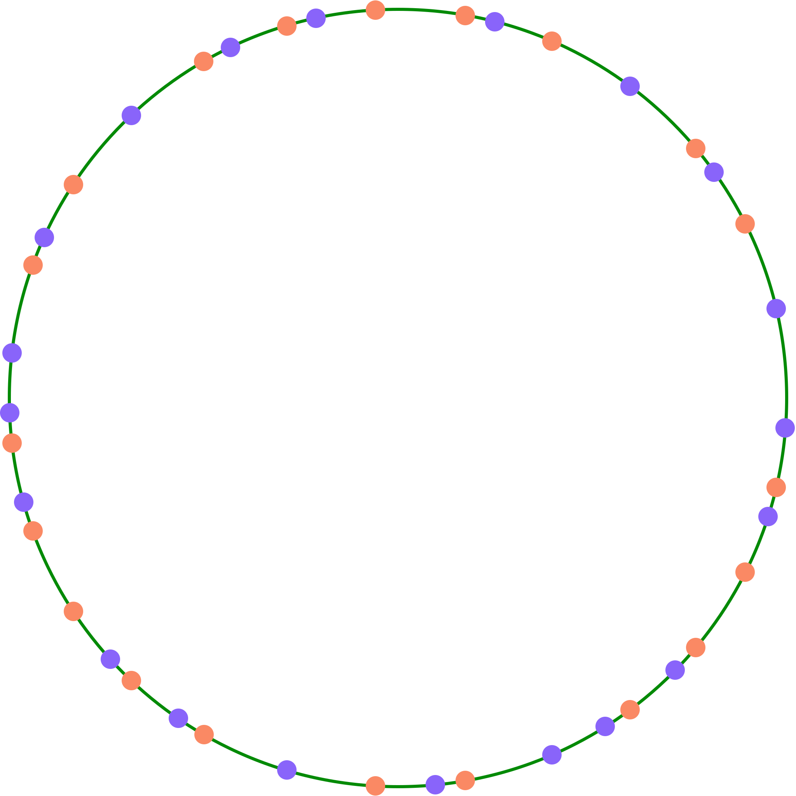
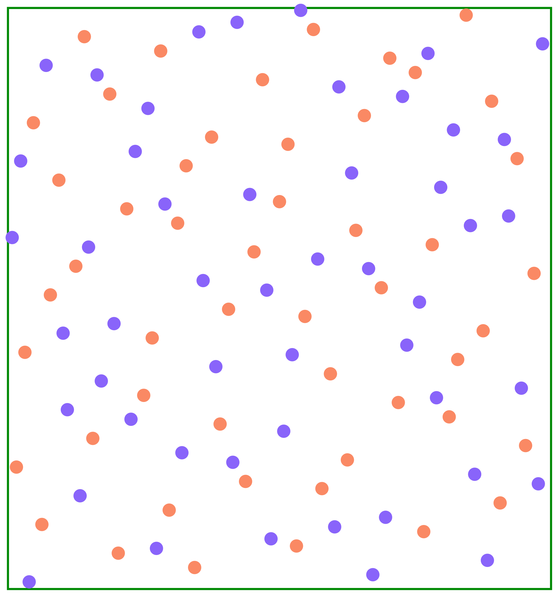
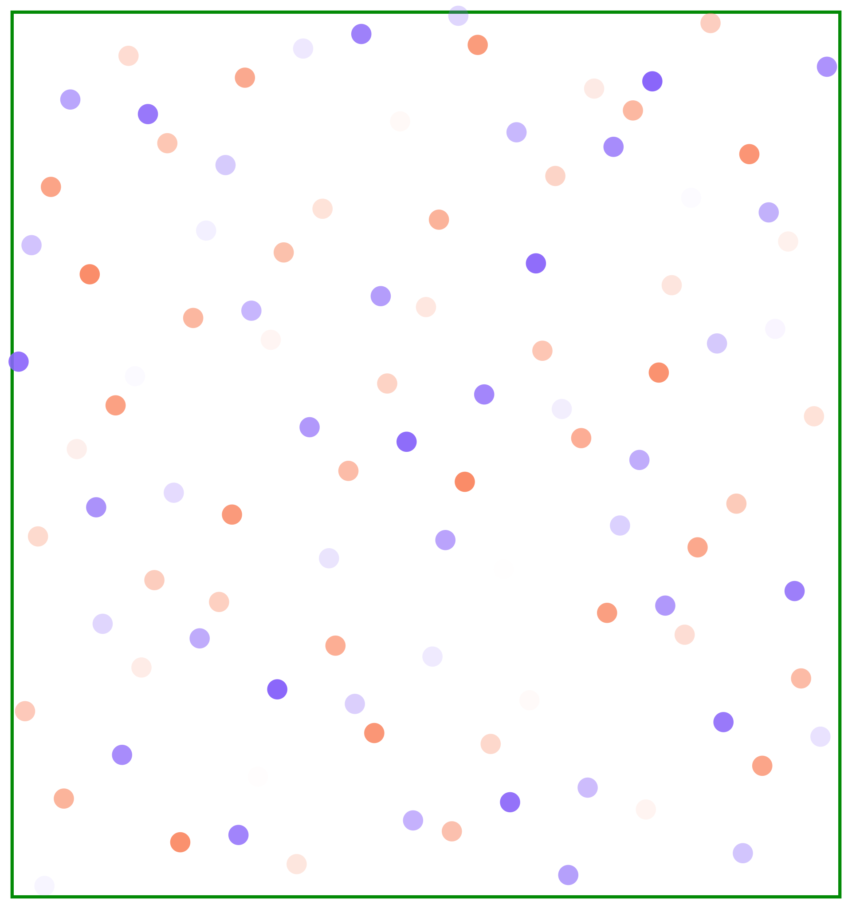
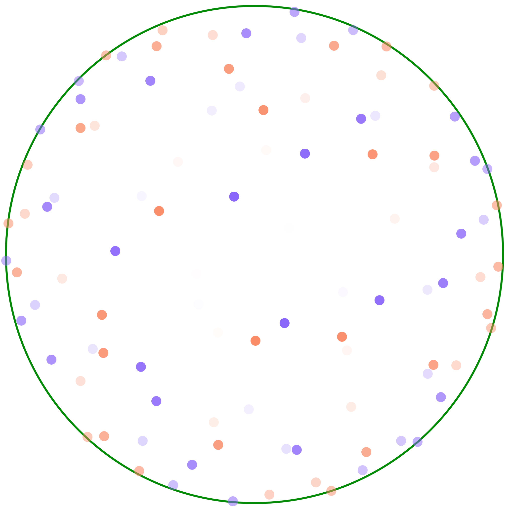
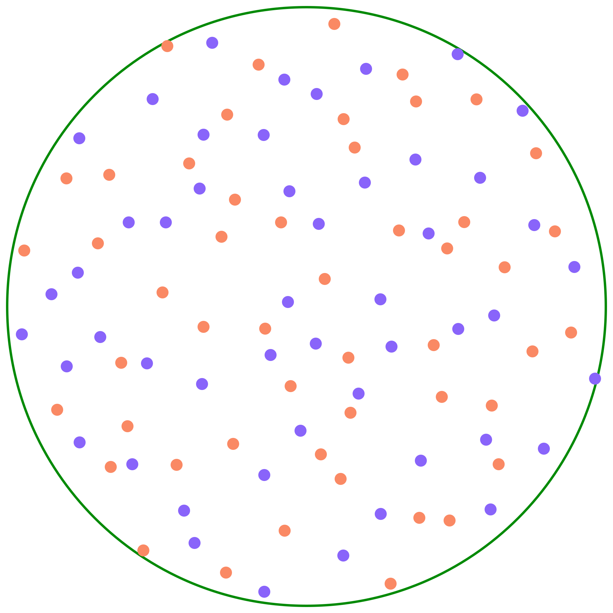
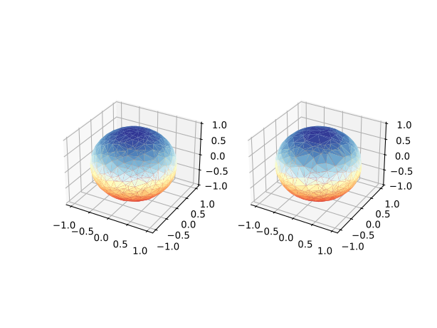
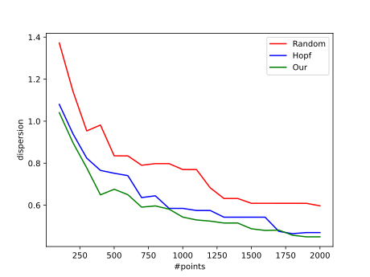
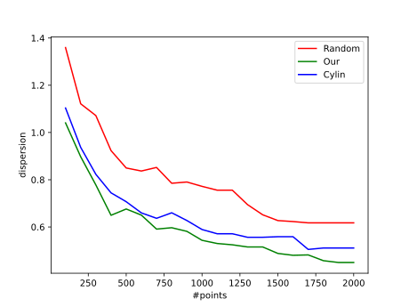
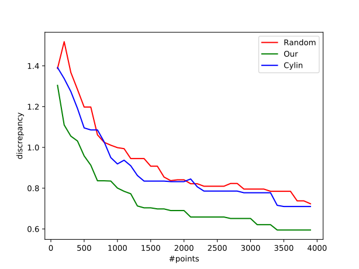
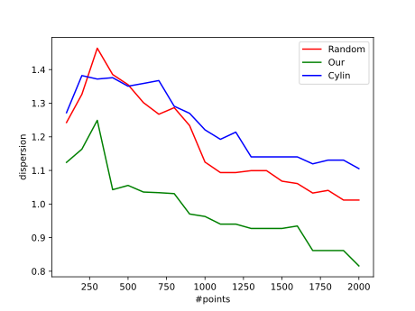

---
author:
  - Wai-Shing Luk
bibliography:
  - n-sphere.bib
title: Low-Discrepancy Sampling on Higher-Dimensional Spheres
abstract: >-
  This paper studies the generation of low-discrepancy point sets on $n$-dimensional spheres.
  Low-discrepancy sequences (LDS) are widely used in numerical integration, optimisation and
  simulation, and the quality of a point set on $S^n$ is governed by three properties: uniformity,
  determinism and incrementality. We propose a construction of low-discrepancy sequences on $S^n$
  based on the van der Corput sequence, and describe the recursive algorithm, the lookup tables
  that implement its inverse, and reference implementations in several languages. Numerical
  experiments compare the proposed method with random sampling and with established approaches,
  namely the Hopf-coordinate and cylindrical-mapping methods; because random sampling is
  stochastic, its dispersion is reported as a mean and standard deviation over independent trials.
...

# Motivation

Low-discrepancy sequences (LDS) arise throughout mathematics, computer science and engineering. Compared with random sampling, they distribute points more evenly over the sampling domain, which makes them valuable for numerical integration, optimisation and simulation. Sampling the three-dimensional sphere is well understood, but efficient methods for higher dimensions remain scarce.

Low-discrepancy sequences offer three advantages over random sampling:

1. **Uniformity.** The points are spread evenly over the sampling region, avoiding clusters and large gaps.
2. **Determinism.** For a fixed starting point and parameters, the sequence is exactly reproducible.
3. **Incrementality.** This is the most important property: points can be appended one at a time while the whole set stays evenly distributed. It matters when the required number of samples is not known in advance, for example in robotics, where one may stop after a few points or change strategy.

The main drawback is cost: generation becomes slower as the number of points grows.

Higher dimensions introduce further difficulties. An even distribution becomes harder to achieve as the dimension increases, an effect known as the *curse of dimensionality*, and, while methods for the $2$-sphere are well established, the higher-dimensional theory is still developing. In particular, no single strategy is known that applies uniformly across all dimensions while preserving uniformity, determinism and incrementality.

This paper proposes a construction of low-discrepancy sequences on $S^n$ based on the van der Corput sequence, addressing the difficulties of high-dimensional sampling while retaining the properties above. The method is relevant to several areas:

- **Robot motion planning** [@yershova2010generating]. On $S^3$ and $SO(3)$, Halton point sets are evenly distributed and therefore suit path planning and attitude control, improving both computational efficiency and trajectory accuracy.
- **Wireless communication coding** [@utkovski2006construction]. In spherical coding for MIMO systems the points serve as codewords, improving signal stability and transmission quality.
- **Multivariate empirical mode decomposition** [@rehman2010multivariate]. Direction vectors on higher-dimensional spheres, obtained by the cylindrical mapping of low-discrepancy sequences, support more accurate signal models.
- **Filter bank design** [@mandic2011filter]. The same cylindrical mapping underlies the filter-bank analysis of multivariate empirical mode decomposition, allowing more precise filter parameters to be constructed.
- **Statistical and machine learning.** They provide deterministic, evenly distributed coverage of a normalised parameter space.

Section 2 reviews low-discrepancy sequences, Section 3 surveys related work, Section 4 presents the construction on $S^n$ together with the numerical details of its table lookup, Section 5 describes the reference implementations and their cross-language verification, Section 6 reports the numerical experiments, and Section 7 concludes.

# Overview of Low-Discrepancy Sequences

## The van der Corput Sequence

The van der Corput sequence is the one-dimensional low-discrepancy sequence on $[0,1]$. It is constructed by reversing the base-$b$ digits of the non-negative integers, where $b$ is usually prime, and it is named after the Dutch mathematician Johannes van der Corput, who introduced it in 1935 [@vandercorput1935]. Writing $n = \sum_{k \ge 0} a_k b^k$ with digits $a_k \in \{0,\dots,b-1\}$, the $n$-th term is the *radical inverse*

$$\phi_b(n) = \sum_{k \ge 0} \frac{a_k}{b^{k+1}},$$

that is, the base-$b$ digits of $n$ reflected about the radix point.

{width="90%"}

Incrementality is visible in the figure: the first ten points (orange) and the next ten (purple) are each evenly spread, and their union is evenly spread as well. Few other sampling methods have this property.

Concretely, given an index $k$ and a base $b$ (default $2$), the generator returns the $k$-th value of the sequence in $[0,1]$. It repeatedly divides $k$ by $b$ and assembles the fractional value from the remainders; equivalently, it writes $k$ in base $b$ and reads the digits in reverse after the point. For instance, with $b=2$ the third element is $011_2$, which reverses to $0.11_2 = 0.75$.
```{=latex}
\begin{algorithm*}[t]
\caption{Radical inverse (the van der Corput sequence)}
\begin{algorithmic}[1]
\Function{RadicalInverse}{$k, b$}
  \State $r \gets 0$;\quad $f \gets 1$
  \While{$k > 0$}
    \State $f \gets f / b$
    \State $r \gets r + (k \bmod b)\, f$
    \State $k \gets \lfloor k / b \rfloor$
  \EndWhile
  \State \Return $r$
\EndFunction
\end{algorithmic}
\end{algorithm*}
```


## Unit Circle $S^1$

The construction extends to the unit circle by treating the van der Corput value as an angle:

1. take the next value from the van der Corput sequence;
2. multiply it by $2\pi$ to obtain an angle $\theta \in [0,2\pi)$;
3. return $[x,y] = [\cos\theta, \sin\theta]$.

The essential step is the conversion of a one-dimensional sequence into points on a two-dimensional circle by interpreting the sequence value as an angle.

{width="90%"}

## Halton Sequence on $[0,1]^n$

The Halton sequence combines two or more van der Corput sequences that use distinct prime bases; it is named after Halton and Rutishauser, who developed it in the 1960s [@halton1960]. The resulting points are evenly distributed over the unit square, without the regularity of a grid, which makes the sequence useful for two-dimensional sampling.

{width="90%"}

The construction generalises to higher dimensions: combining $n$ van der Corput sequences with pairwise-coprime bases gives

$$
\begin{aligned}
[x_1, x_2, \dots, x_n] = {}& [\mathrm{vdc}(k,b_1),\\
& \mathrm{vdc}(k,b_2), \dots, \mathrm{vdc}(k,b_n)].
\end{aligned}
$$

Such point sets are the basis of quasi-Monte Carlo (QMC) methods.

{width="90%"}

## Unit Sphere $S^2$

Points on the unit sphere can be generated by combining a one-dimensional sequence for the height with a circular sequence for the horizontal position. This cylindrical mapping has been used in computer graphics [@wong1997sampling] and, applied recursively, it is also the basis for generating low-discrepancy point sets on higher-dimensional spheres in multivariate empirical mode decomposition [@rehman2010multivariate; @mandic2011filter]. Given the azimuth $\varphi$ and the height $z$, the point is

$$[x,y,z] = [\,r\cos\varphi,\; r\sin\varphi,\; z\,], \qquad r = \sqrt{1-z^2},$$

where

- $z = 2\,\mathrm{vdc}(k,b_2) - 1 \in [-1,1]$, and
- $\varphi = 2\pi\,\mathrm{vdc}(k,b_1) \in [0,2\pi)$.

{width="90%"}

## $S^3$ and $SO(3)$

The construction extends to the 3-sphere (a four-dimensional sphere) through the Hopf fibration [@mitchell2008sampling; @yershova2010generating], which was originally used to build optimal deterministic grids on $S^3$ and $SO(3)$. Hopf coordinates are

- $x_1 = \cos(\theta/2)\cos(\psi/2)$,
- $x_2 = \cos(\theta/2)\sin(\psi/2)$,
- $x_3 = \sin(\theta/2)\cos(\varphi + \psi/2)$,
- $x_4 = \sin(\theta/2)\sin(\varphi + \psi/2)$,

and $S^3$ is a principal circle bundle over $S^2$. The cylindrical mapping of the previous subsection does not extend to higher dimensions, which is why the Hopf construction is needed.

Three van der Corput sequences supply the angles:

- $\varphi = 2\pi\,\mathrm{vdc}(k,b_1)$;
- $\psi = 2\pi\,\mathrm{vdc}(k,b_2)$ for $SO(3)$, or $\psi = 4\pi\,\mathrm{vdc}(k,b_2)$ for $S^3$;
- $z = 2\,\mathrm{vdc}(k,b_3) - 1$, so that $\theta = \cos^{-1} z$.

The first two values are scaled to angles, the third determines $\theta$, and the four coordinates follow from the Hopf formulae.

# Previous Work

The construction proposed in this paper draws on several lines of work, which we briefly survey before presenting the method.

**Low-discrepancy sequences and quasi-Monte Carlo.** The deterministic generation of well-spread points began with the van der Corput sequence [@vandercorput1935], which Halton [@halton1960] extended to several dimensions using pairwise-coprime bases; the Sobol' sequence [@sobol1967] is a widely used alternative. Together these sequences form the basis of quasi-Monte Carlo integration, where deterministic point sets replace pseudo-random points and improve the convergence rate for sufficiently smooth integrands.

**Equidistribution and designs on the sphere.** Distributing points evenly on the sphere is a classical problem. Cui and Freeden [@cui1997equidistribution] study equidistribution on $S^2$ and its use in quadrature, while Brauchart et al. [@brauchart2012qmc] analyse quasi-Monte Carlo designs that attain optimal-order integration error. Saff and Kuijlaars [@saff1997] survey the competing criteria, such as covering radius and Riesz energy, that lead to the Fibonacci-lattice and spiral configurations for distributing many points on a sphere.

**Cylindrical and Hopf mappings.** In computer graphics, Wong, Luk and Heng [@wong1997sampling] popularised the cylindrical equal-area mapping, which converts two one-dimensional low-discrepancy values into a point on $S^2$ with uniform area density. On $S^3$ and $SO(3)$, the Hopf fibration underlies the incremental grids of Mitchell [@mitchell2008sampling] and Yershova et al. [@yershova2010generating], while the quaternion construction of Shoemake [@shoemake1992] provides the corresponding uniform random baseline.

**Random sampling.** For comparison, points uniform on $S^n$ can be obtained either by normalising a Gaussian vector or by the rejection method of Marsaglia [@marsaglia1972]; Fishman [@fishman1996] gives a textbook treatment. These stochastic constructions are simple, but they are neither deterministic nor incremental.

**Spherical codes and applications.** Spherical and Grassmannian codes are central to MIMO communication: Strohmer and Heath [@strohmer2003grassmannian] and Love et al. [@love2003grassmannian] design Grassmannian beamforming codebooks, and Utkovski and Lindner [@utkovski2006construction] construct space-time codes from high-dimensional spherical codes. In signal processing, Rehman and Mandic [@rehman2010multivariate] and Mandic et al. [@mandic2011filter] build multivariate empirical mode decomposition and its filter-bank analysis by projecting the signal along direction vectors on higher-dimensional spheres, generating those vectors from low-discrepancy sequences through the cylindrical mapping. This is the same family of constructions that we use as the `CylindN` baseline in the experiments.

**Gap addressed here.** None of these approaches simultaneously provides uniformity, determinism and incrementality on $S^n$ for arbitrary $n$. The cylindrical and Hopf mappings exploit structure that is special to $S^2$ and $S^3$; optimisation-based designs, such as spherical designs and energy-minimising configurations, are not incremental, because adding a point changes the entire configuration; and random sampling is not deterministic. The construction developed below closes this gap by combining the van der Corput sequence with a recursive, tabulated inverse cumulative distribution that extends to any dimension.

# Our Approach

## Warm-up: Uniform Sampling on the Unit Disk

The construction rests on a single idea: to sample a manifold uniformly, cancel its surface-element weight by inverting the cumulative distribution of that weight. The planar unit disk is the simplest instance, and the sphere below is its direct higher-dimensional analogue. In polar coordinates $(r,\theta)$ the disk's area element is

$$
dA = r \, dr \, d\theta. \tag{1}
$$

The factor $r$ means that a distribution uniform in $\theta$ alone would over-sample the centre. Integrating the radial part,

$$
\int r \, dr = \tfrac{1}{2} r^2, \tag{2}
$$

shows that the radial weight is $r$, so the inverse function needed to cancel it is the square root. The disk is therefore sampled uniformly by

- $\theta = 2\pi\,\mathrm{vdc}(k,b_1)$,
- $r = \sqrt{\mathrm{vdc}(k,b_2)}$,
- $[x,y] = [r\cos\theta, r\sin\theta]$.

The same recipe is applied to spherical boundaries in the following subsections; only the weight changes, from the radial factor $r$ to the trigonometric surface element of $S^n$.

{width="90%"}

## Why the Cylindrical Mapping Works Only for $S^2$

The cylindrical mapping of the unit sphere is a special case, and the surface element shows exactly why it cannot be extended. Write a point of $S^n$ as

$$p = (\cos\theta_n,\ \sin\theta_n\, u), \qquad u \in S^{n-1},$$

so that $\theta_n$ is the angle to the distinguished axis and $u$ is the equatorial direction. The surface element then decomposes into a height part and a spherical part,

$$d^nA = \sin^{n-1}\theta_n\, d\theta_n\, dA_{n-1}(u).$$

Substituting the height $z = \cos\theta_n$, for which $\sin\theta_n\, d\theta_n = -dz$, turns this into

$$d^nA = (1-z^2)^{(n-2)/2}\, dA_{n-1}(u)\, dz.$$

The height and the equatorial direction separate, but the height carries the weight $(1-z^2)^{(n-2)/2}$, which is constant only when $(n-2)/2 = 0$, that is, when $n = 2$. For the $2$-sphere the surface element is therefore

$$d^2A = d\varphi\, dz,$$

with no height dependence: sampling the azimuth $\varphi$ and the height $z$ independently and uniformly reproduces the area measure exactly, which is precisely the cylindrical mapping of Section 2.

For $n \ge 3$ the weight $(1-z^2)^{(n-2)/2}$ is not constant, so a uniform height $z \in [-1,1]$ is biased. It over-samples the poles, where the true density is lowest, and under-samples the equator, where it is highest. Sampling the azimuth uniformly remains correct, but the height must be drawn from the density proportional to $(1-z^2)^{(n-2)/2}$; equivalently, $\theta_n$ must be drawn by inverting the cumulative integral of $\sin^{n-1}\theta_n$. That inverse is the function $f_{n-1}$ met in the following subsections, and it is the reason the construction replaces the uniform height of the cylindrical mapping by a table lookup. The equatorial direction $u \in S^{n-1}$ is then handled by the same procedure, recursively.

## Higher Dimensions: $S^3$ and Beyond

On the sphere the surface element is more complicated and its inverse is no longer obvious. In hyperspherical coordinates the $3$-sphere $S^3$ has the parametrisation

- $x_0 = \cos\theta_3$,
- $x_1 = \sin\theta_3\cos\theta_2$,
- $x_2 = \sin\theta_3\sin\theta_2\cos\theta_1$,
- $x_3 = \sin\theta_3\sin\theta_2\sin\theta_1$,

with $\theta_1 \in [0,2\pi)$ and $\theta_2,\theta_3 \in [0,\pi]$, and surface element

$$dA = \sin^{2}\theta_3\,\sin\theta_2\,d\theta_1\,d\theta_2\,d\theta_3.$$

Only the azimuth $\theta_1$ carries constant weight; each remaining angle $\theta_j$ enters with weight $\sin^{j-1}\theta_j$, so it is sampled by inverting the cumulative integral of that weight. The construction builds $S^3$ recursively from the circle:

- start from the unit circle $p_1 = [\cos\theta_1, \sin\theta_1]$ with $\theta_1 = 2\pi\,\mathrm{vdc}(k,b_1)$;
- the angle $\theta_2$ has weight $\sin\theta_2$, whose inverse is the closed form $\theta_2 = \cos^{-1}(1 - 2\,\mathrm{vdc}(k,b_2))$, giving a point $p_2$ on $S^2$;
- with $f_2(\theta) = \int_0^\theta \sin^2\varphi\,\mathrm{d}\varphi = \tfrac{1}{2}(\theta - \cos\theta\sin\theta)$, map $\mathrm{vdc}(k,b_3)$ onto $f_2$ by $t = f_2(0) + (f_2(\pi)-f_2(0))\,\mathrm{vdc}(k,b_3) = (\pi/2)\,\mathrm{vdc}(k,b_3)$;
- recover $\theta_3 = f_2^{-1}(t)$ by table lookup;
- set $p_3 = [\cos\theta_3,\ \sin\theta_3 \cdot p_2]$.

## Generalisation to $S^n$

The same recursion applies in every dimension. Writing $f_m(\theta) = \int_0^\theta \sin^m\varphi\,\mathrm{d}\varphi$, only $f_0$ and $f_1$ admit closed-form inverses; for $m \ge 2$ the inverse $f_m^{-1}$ has no closed form and must be tabulated numerically. Because the recurrence that defines $f_m$ is itself recursive, higher-dimensional spheres are generated from a family of lookup tables.

The hyperspherical coordinates of $S^n$ are

- $x_0 = \cos\theta_n$,
- $x_1 = \sin\theta_n\cos\theta_{n-1}$,
- $x_2 = \sin\theta_n\sin\theta_{n-1}\cos\theta_{n-2}$,
- $\cdots$
- $x_{n-1} = \sin\theta_n\sin\theta_{n-1}\cdots\cos\theta_1$,
- $x_n = \sin\theta_n\sin\theta_{n-1}\cdots\sin\theta_1$,

where $\theta_1 \in [0,2\pi)$ and $\theta_2,\dots,\theta_n \in [0,\pi]$, with surface element

$$
d^nA = \sin^{n-1}\theta_n\,\sin^{n-2}\theta_{n-1}\cdots\sin\theta_2\,d\theta_1\,d\theta_2\cdots d\theta_n.
$$

## How to Generate the Point Set

A point on $S^n$ is assembled from $n$ van der Corput values, one per angle:

- set $p_1 = [\cos\theta_1, \sin\theta_1]$ with $\theta_1 = 2\pi\,\mathrm{vdc}(k,b_1)$;
- let $f_m(\theta) = \int_0^\theta \sin^m\varphi\,\mathrm{d}\varphi$ on $(0,\pi)$, defined recursively by

  {\footnotesize
  $$
  f_m(\theta) =
  \begin{cases}
    \theta          & m = 0 , \\
    -\cos\theta     & m = 1 , \\
    \begin{aligned}
    (1/m)\bigl(-\cos\theta&\sin^{m-1}\theta\\
     &+(m-1) f_{m-2}(\theta)\bigr)
    \end{aligned} & m \ge 2 .
  \end{cases}
  $$
  }

  For example, the two equivalent forms of $f_3$ are
  $$
  \begin{aligned}
  &(1/3)( -\cos\theta \sin^2\theta - 2 \cos\theta)\\
  &(-1/3) \cos\theta (3 - \cos^2\theta).
  \end{aligned}
  $$
  Each $f_m$ is monotone increasing on $(0,\pi)$;
- for the angle $\theta_j$ with $j = 2,\dots,n$, which carries the weight $\sin^{j-1}\theta_j$, map $\mathrm{vdc}(k,b_j)$ uniformly onto $f_{j-1}$ by $t_j = f_{j-1}(0) + (f_{j-1}(\pi)-f_{j-1}(0))\,\mathrm{vdc}(k,b_j)$;
- set $\theta_j = f_{j-1}^{-1}(t_j)$ by table lookup ($f_0$ and $f_1$ reduce to the closed forms of the previous subsection);
- assemble the point recursively as $p_j = [\cos\theta_j,\ \sin\theta_j \cdot p_{j-1}]$, up to $p_n$.


```{=latex}
\begin{algorithm*}[t]
\caption{Point on $S^n$ at sequence index $k$}
\begin{algorithmic}[1]
\Function{PointAt}{$k, n, b_1, \dots, b_n$}
  \If{$n = 1$}
    \State $v_1 \gets \Call{RadicalInverse}{k, b_1}$
    \State \Return $\bigl[\cos(2\pi v_1),\ \sin(2\pi v_1)\bigr]$
  \EndIf
  \State $v \gets \Call{RadicalInverse}{k, b_n}$
  \State $t \gets f_{n-1}(0) + \bigl(f_{n-1}(\pi) - f_{n-1}(0)\bigr)\, v$
  \State $\theta \gets f_{n-1}^{-1}(t)$ \Comment{inverse CDF, table lookup}
  \State $s \gets \Call{PointAt}{k, n-1, b_1, \dots, b_{n-1}}$
  \State \Return $\bigl[\cos\theta,\ \sin\theta \cdot s\bigr]$
\EndFunction
\end{algorithmic}
\end{algorithm*}
```
## Numerical Mechanics of the Table Lookup

For each order $m \ge 2$ the inverse $f_m^{-1}$ is replaced by a table that is built once and cached for the lifetime of the process:

- **Resolution.** Every table is sampled on the same $300$-point uniform grid of $[0,\pi]$, with spacing $h = \pi/299 \approx 1.05\times10^{-2}$ rad. The recurrence for $f_m$ is evaluated at those nodes, so no iterative root finding is required.
- **Interpolation.** To invert a target $t$, the bracketing nodes are found by binary search and the value is recovered by linear interpolation; the lookup costs $O(\log 300) \approx 9$ comparisons and is clamped at the endpoints. The scalar `bisect`-based routine and the vectorised `numpy.interp` routine share the same grid.
- **Precision.** Because the inverse is recovered by piecewise-linear interpolation, the discretisation error in the angle is $O(h^2)$. Measured against a $200000$-point reference grid, the maximum error is $3.4\times10^{-4}$, $2.7\times10^{-4}$ and $2.3\times10^{-4}$ rad for $m = 2, 3, 4$ respectively; increasing the node count reduces the error quadratically.
- **Memory.** A table holds $300$ double-precision values, about $2.4$ kB. Generating on $S^n$ requires $f_2,\dots,f_{n-1}$ together with a few shared trigonometric grids, giving $O(n)$ tables and under $20$ kB for $n \le 5$; the tables are built lazily and cached.

# Implementation

The construction is implemented in Python, Rust and C++; every version follows the same recursion. The components are:

1. a van der Corput generator producing uniform values in $[0,1]$;
2. interpolation routines that invert the cached tables of the previous subsection;
3. the abstract `SphereGen` interface, which fixes the common methods `pop` and `reseed`;
4. two recursive generators: `Sphere3` generates points on $S^3$ directly, and `SphereN` builds a higher-dimensional sphere from a lower-dimensional one, delegating the remaining coordinates to a child generator and bottoming out at $S^3$.

Because the recursion bottoms out at $S^3$, points can be generated in any dimension, limited only by memory.

Generation begins by constructing a `SphereN` object, which uses `Sphere3` or further `SphereN` instances for the lower dimensions. Each point combines one van der Corput value, through sine, cosine and interpolation, with the coordinates of the lower-dimensional sphere.

## Reference Implementations

Reference implementations of the construction are available in several languages: `lds-gen` (Python), `lds-rs` (Rust), and the C++20 libraries `lds-cpp` and `lds-gen-cpp`. All four provide the same core generators (`VdCorput`, `Halton`, `Circle`, `Disk`, `Sphere`, `Sphere3Hopf` and `HaltonN`), whereas the recursive `Sphere3` and `SphereN` generators currently exist in Python, Rust and `lds-gen-cpp` only.

## Cross-Language Verification

The implementations agree numerically. For a fixed seed the core generators produce bit-identical output across languages, and the recursive sphere generators agree to at least fifteen decimal places; the only discrepancy observed was a single coordinate differing in the sixteenth decimal place, which is consistent with machine epsilon for double precision and with the different `libm` implementations used by the compilers and interpreters.

## Performance

Because each generator is stateful, concurrency is handled differently. Python guards `pop` and `reseed` with a lock, Rust uses a lock-free atomic counter, and the C++ implementations are not thread-safe and assume a single thread. This choice interacts with performance: measured timings for the recursive sphere generators, in nanoseconds per point, are 657 (C++), 1035 (Rust) and 7749 (Python) for `Sphere3`; 1665, 1607 and 12153 for `SphereN` on $S^4$; and 2312, 2020 and 48443 for `SphereN` on $S^5$. Compile-time template bases let the C++ compiler replace the modulo by a multiplication, making it fastest for the shallow generator, while Rust's lock-free counter scales better with recursion depth and is fastest for $S^4$ and $S^5$; Python carries interpreter overhead in the table lookup and the trigonometric evaluation.

# Numerical Experiments

The experiments compare the quality of point distributions obtained by random sampling and by low-discrepancy sequences. For each method the points are generated, their convex hull is built with `scipy.spatial.ConvexHull`, and a dispersion measure is computed from the hull's simplices. Dispersion is the spread of neighbour distances,

$$
\max_{a \in \mathcal{N}(b)} \{D(a,b)\} - \min_{a \in \mathcal{N}(b)} \{D(a,b)\},
$$

where $D(a,b) = \sqrt{1 - a^\mathsf{T} b}$. A smaller value indicates a more uniform point set.

Point sets are generated on $S^3$, $S^4$ and $S^5$ using the prime bases $(2,3,5)$, $(2,3,5,7)$ and $(2,3,5,7,11)$. Table 1 reports $600$-point sets for every method, whereas the figures sweep the number of points to show how the dispersion behaves as the set grows.

Random points on $S^n$ are obtained by normalising a vector drawn from a multidimensional Gaussian density; the spherical symmetry of the density makes the result uniformly distributed on $S^n$ [@fishman1996]. Because this construction is stochastic, each random entry in Table 1 is the mean of $30$ independent trials, with the standard deviation reported alongside it. The LDS points, produced by the `SphereN` and `CylindN` generators, are deterministic and are reported as single values.



{width="90%"}

{width="90%"}

{width="90%"}

{width="90%"}

Table 1 reports the dispersion of 600-point sets generated by random sampling and by
the two deterministic generators. Lower values indicate a more uniform point set; the
random column gives the mean $\pm$ one standard deviation over 30 independent trials.

```{=latex}
\begin{table*}[t]
\centering
\caption{Dispersion of 600-point sets on $S^3$, $S^4$ and $S^5$ (lower is better; random entries are means over 30 trials; the best value in each row is in bold).}
\begin{tabular}{lrrr}
\hline
Sphere (bases) & Random (30 trials) & \texttt{CylindN} & \texttt{SphereN} \\
\hline
$S^3$ ($2,3,5$) & $0.845 \pm 0.041$ & 0.659551 & \textbf{0.650145} \\
$S^4$ ($2,3,5,7$) & $1.090 \pm 0.038$ & 1.050584 & \textbf{0.912591} \\
$S^5$ ($2,3,5,7,11$) & $1.252 \pm 0.041$ & 1.358791 & \textbf{1.035655} \\
\hline
\end{tabular}
\end{table*}
```

## Validation

Reference values for the dispersion are pinned down by regression tests that compare the computed values with the tabulated numbers to within a small decimal tolerance. The proposed method is compared with random sampling, with the Hopf-coordinate method on $S^3$, and with cylindrical mapping on $S^4$ and $S^5$.

The proposed method is more uniform than the Hopf-coordinate method on $S^3$ and than cylindrical mapping on $S^4$ and $S^5$. On every sphere its dispersion is below the mean of the random baseline by more than one standard deviation, and the advantage is most pronounced when the number of points is small.

# Conclusions

This paper has presented a construction of low-discrepancy sequences on $n$-dimensional spheres based on the van der Corput sequence. It addresses the difficulties of high-dimensional sampling while preserving uniformity, determinism and incrementality, and it covers the van der Corput and Halton sequences, the unit circle and sphere, the Hopf fibration for $S^3$, and the recursive extension to $S^n$.

## Future Work

The method generates point sets of high uniformity efficiently and is simple to implement, which makes it useful for Monte Carlo simulation, optimisation and machine learning. Future work includes faster table lookup or closed-form approximations for large $n$, and extensions to $SO(n)$ and other manifolds.

# Acknowledgements {.unnumbered}

The authors thank the National Science Foundation for supporting this research.

# Author Contributions {.unnumbered}

The authors contributed equally to this work.

# Funding {.unnumbered}

This research was supported by the National Science Foundation under Grant No. 1234567890.

# Competing Interests {.unnumbered}

The authors declare that they have no competing interests.

# Availability of Data and Materials {.unnumbered}

The data and materials used in this study are available from the corresponding author on request.

# References {#references .unnumbered}
